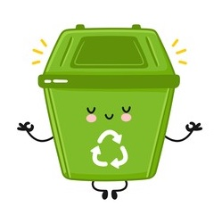

# Summary
`clean-up` is a tool to help delete unwanted files from a directory. It can be used as a CLI tool, as a NodeJS module or running it as a command in your CI pipelines.

# Installation
You can install `clean-up` globally by running the command:
1. Using npm - `npm install clean-up -g`.
2. Using Yarn - `yarn global add clean-up`.

You can also install it as a dependency on your project by running the commands:
1. Using npm - `npm install clean-up --save`.
2. Using Yarn - `yarn add clean-up`. 

# Usage
`clean-up` can be used in 2 way:
1. As a CLI tool to be used either in your local development environment or CI pipelines.
2. As a NodeJS module to be used via `require('clean-up')`.

As a CLI tool, it comes with 2 flavors:
1. Interactive mode - this allows you to enter/select options and flags interactively.
2. CLI arguments mode - you specify all the options and flags when calling the tool via the terminal.

# Sample usage
> To use the tool in your NodeJS module just require it using : `require('clean-up')`.  
> To use it as a CLI tool in interactive mode just run the command: `node clean-up`.  
> To use it as a CLI too in CLI arguments mode, just run the command: `node clean-up [options] [flags]`.

# Options
1. `delete` - `Object` with the delete options. It includes:  
    * `filename` - glob pattern.   
    * `age` - the age of the file as a `moment` object. You can use operators such as  less than `<`, equal to `=`, greater than `>`, less than or equal to `<=` and greater than or equal to `>=`.  
    * `size`- size in bytes. You can use operators such as  less than `<`, equal to `=`, greater than `>`, less than or equal to `<=` and greater than or equal to `>=`.
2. `ignore` - `Object` that has the options to ignore. It includes:  
    * `filename` - glob pattern.   
    * `age` - the age of the file as a `moment` object. You can use operators such as  less than `<`, equal to `=`, greater than `>`, less than or equal to `<=` and greater than or equal to `>=`.  
    * `size`- size in bytes. You can use operators such as  less than `<`, equal to `=`, greater than `>`, less than or equal to `<=` and greater than or equal to `>=`.
3. `limit` - `Object` to indicate the operations limits such as:
    * `max-file-number` - maximum number of files to delete.
    * `sort-by` - how to sort the files being cleaned up. The options are `name`, `age` and `size`.
    * `sort-direction` - whether to sort by `ASC` or `DESC`. 

4. `cron` - cron pattern to indicate how often to run the delete operation.

# Flags
As a CLI tool, you can pass the following flags to dictate how the tool will do the delete operation:
1. `--recursive` or `-r` - a boolean value to delete files in subfolders as well.
2. `--levels = <number>` or `-l=<number>` - used together with the `--recursive` flag to indicate the level of subdirectories to delete files in.
3. `--verbose` or `-v` - a boolean value to indicate whether to show logs on the terminal.
4. `--soft-delete` or `-sd`- a boolean value to indicate whether to just put the deleted files in the trash or to delete them permanently.
5. `--dry-run` or `-dr`- a boolean value to indicate whether to show the details of the files to be deleted (number of files, total size).
6. `--help` or `-h` - a boolean value to show the tool's manual. 
7. `--version` or `-v` - a boolean value to show the tool's version.